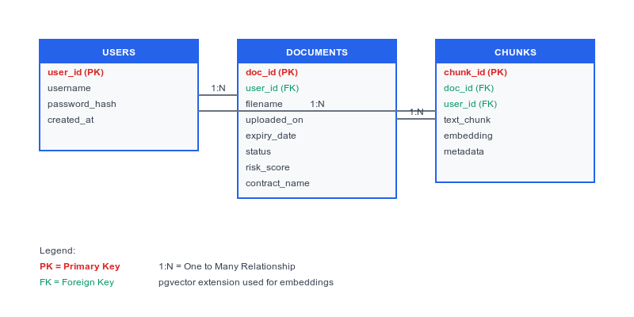

# SaaS Contracts Dashboard - Full Stack Application

A modern full-stack SaaS application for contract management with AI-powered insights, natural language querying, and vector search capabilities.

## 🚀 Live Demo

- **Frontend**: [https://saas-contracts-dashboard-mansi.netlify.app](https://saas-contracts-dashboard-mansi.netlify.app)
- **Backend API**: [https://contracts-saas-api.onrender.com](https://contracts-saas-api.onrender.com)
- **API Docs**: [https://contracts-saas-api.onrender.com/docs](https://contracts-saas-api.onrender.com/docs)

## 📋 Features

### Core Functionality
- **Multi-tenant Authentication** - JWT-based secure user management
- **Document Upload** - Drag & drop support for PDF, TXT, DOCX files
- **Vector Search** - Semantic search across contract content using embeddings
- **Queries** - Q&A over contract documents
- **Professional Dashboard** - Modern SaaS interface with search and filtering

## 🛠️ Technology Stack

### Frontend
- **Framework**: React 19 with Hooks
- **Styling**: Tailwind CSS
- **State Management**: Context API
- **Routing**: React Router DOM
- **Deployment**: Netlify

### Backend
- **Framework**: FastAPI (Python)
- **Database**: SQLite with vector embeddings
- **Authentication**: JWT with bcrypt hashing
- **Deployment**: Render

### Architecture
- **Multi-tenant**: User data isolation
- **RESTful API**: Clean API design with OpenAPI docs
- **Vector Storage**: Embeddings stored as JSON in database
- **CORS Enabled**: Secure cross-origin requests

## 🚀 Quick Start

### Prerequisites
- Node.js 18+
- Python 3.11+

### Frontend Setup
```bash
cd saas-contracts-dashboard
npm install
cp .env.example .env
npm start
```

### Backend Setup
```bash
cd backend
pip install -r requirements.txt
cp .env.example .env
uvicorn main:app --reload
```

### Usage
1. Sign up with any username/password
2. Upload PDF, TXT, or DOCX contracts
3. Browse contracts in the dashboard
4. Ask questions
5. View detailed contract analysis and insights

## 📁 Project Structure

```
├── saas-contracts-dashboard/     # React frontend
│   ├── src/
│   │   ├── components/           # Reusable UI components
│   │   ├── context/              # React Context providers
│   │   ├── pages/                # Page components
│   │   └── services/             # API service layer
│   ├── public/                   # Static assets
│   └── netlify.toml              # Netlify config
├── backend/                      # FastAPI backend
│   ├── main.py                   # FastAPI app
│   ├── database.py               # Database models
│   ├── auth.py                   # Authentication
│   ├── requirements.txt          # Python dependencies
│   └── render.yaml               # Render config
├── sample-contracts/             # Test contract files
└── database-schema.png           # Database diagram
```

## 🧪 How to Use

1. **Authentication** - Sign up or login with any credentials
2. **Upload Documents** - Drag & drop PDF/TXT/DOCX contract files
3. **Browse Dashboard** - View contracts with search and filtering
4. **Contract Details** - View detailed
5. **Ask Questions** - Query contract content

## 📊 Database Schema



### Tables
- **Users**: User accounts with authentication
- **Documents**: Contract files and metadata
- **Chunks**: Text segments with vector embeddings for search

## 🚀 Deployment

### Production Environment
- **Frontend**: Netlify (https://saas-contracts-dashboard-mansi.netlify.app)
- **Backend**: Render (https://contracts-saas-api.onrender.com)
- **Database**: SQLite with vector embeddings

### Deployment Commands
```bash
# Frontend (Netlify)
npm run build

# Backend (Render)
# Automatic deployment via GitHub integration
```

## 🔐 Security & Architecture

### Security Features
- **Multi-tenant Architecture**: Complete user data isolation
- **JWT Authentication**: Secure token-based auth with expiration
- **Password Security**: bcrypt hashing with salt
- **CORS Protection**: Configured for frontend domain

### Architecture Patterns
- **RESTful API**: Clean separation of frontend and backend
- **Vector Search**: Semantic similarity using embeddings
- **Async Processing**: FastAPI async/await for performance
- **Responsive Design**: Mobile-first frontend approach

## 📝 API Documentation

Complete API documentation available at:
- **Interactive Docs**: [/docs](https://contracts-saas-api.onrender.com/docs)
- **OpenAPI Spec**: [/openapi.json](https://contracts-saas-api.onrender.com/openapi.json)

### Key Endpoints
- `POST /signup` - User registration
- `POST /login` - User authentication  
- `POST /upload` - Contract file upload
- `GET /contracts` - List user contracts
- `GET /contracts/{id}` - Contract details
- `POST /ask` - Natural language queries

## 🔧 Development

### Local Development
1. Clone repository
2. Set up frontend and backend (see Quick Start)
3. Use sample contracts for testing
